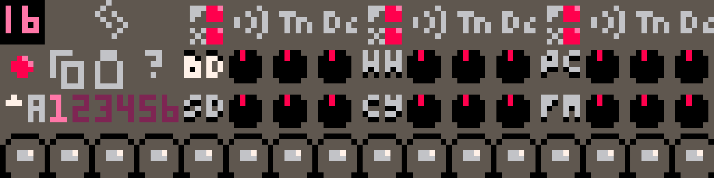

# Reference

## Basic Usage

Most controls on the screen respond to one of a small number of gestures: clicks, vertical drags, and double clicks.
Generally, clicking either activate a button's effect or toggle a button's state, dragging will alter the value of a
knob or a numeric control, and double-clicking will reset a knob to its default value. There are also a few buttons for
manipulating pattern data that respond to vertical drags (the transpose and rotate pattern buttons).

When you click or drag a control, it becomes highlighted in blue. This indicates that the control is now selected, and
will respond to control-specific keyboard commands, such as the up and down arrow keys for altering step, note, or knob
values. If a control does not get a blue highlight, that means it is disabled in the current mode -- for example, you
cannot change the song position in pattern mode.

## Transport

<figure markdown>
  {style="display:block;width:100%;margin-left:auto;margin-right:auto"}
  <figcaption>The RP-8 transport controls (from left): play/pause, record, rewind, page toggle, mode toggle, song position, loop start, loop enable, loop length, and file menu.</figcaption>
</figure>

The transport provides control over RP-8's playback and overall behavior. In pattern mode, you can start or pause the
sequencer, change between pattern mode and song mode (see [Modes](#modes)), switch sequencer pages (see [Pages](#pages)), and access
the file menu (see [Loading and Saving](#loading-and-saving)). In song mode, the position control, loop enable/start/length controls, and record
button will also become available.

To change the numeric controls, click and drag up/down to increase/decrease the values, or use the arrow keys.

### Modes

RP-8 has two modes: **pattern mode** and **song mode**. All the same devices and sound creation machinery are available
in both, however, they have different purposes. Pattern mode gives you immediate direct control of every parameter, so
it is ideal for learning, experimentation, and coming up with new ideas. Song mode records enables several features for
recording, editing, and replay of parameter changes, and so is best for when you want to start recording multi-bar
sequences and complex automation.

### Pages

The RP-8 UI also has two sequencer pages, each accessible in both pattern and song modes. You can toggle between them
with the `tab` key, or by clicking the `P1` / `P2` button near the top of the screen. Each page shows a different set
of pitch controls for each pattern.

RP-8 starts on page 1. This page lets you control the pitch of oscillator 1 on both synths, and shows the drum pattern step buttons.

Page 2 shows secondary / relative pitch controls for all three devices. These controls let you detune each drum (on the
drum machine) or the second oscillator (on each synth) relative to the main pitch for each device. For the synth, this
means you are detuning oscillator 2 relative to oscillator 1. For the drums, you are detuning each drum relative to
whatever pitch is determined by the sound controls. (The base pitch of each drum with all knobs at their default
positions is usually G in some octave.)

### Loading and Saving

To load a song, drag the song file onto the RP-8 window. Alternatively, you can copy the song data to your clipboard,
paste it into RP-8 (using ctrl-v on Windows/Linux or cmd-v on MacOS), and use the `o` hotkey to load from the
clipboard.

To save songs, you can use the file menu.

<figure markdown>
  {style="display:block;width:50%;margin-left:auto;margin-right:auto"}
  <figcaption>The RP-8 file menu</figcaption>
</figure>

This screen allows you to name your song and save it, as well as open the RP-8 data folder - which, depending on your OS
and how you are running RP-8, may be difficult to find otherwise. Use the up and down arrow keys to select an option,
then the enter key to act. You can access this menu by clicking the disk icon by the transport controls, or by using
the `f` key.

## Arrangement Editing

Below the transport, on the left side of the screen, are buttons for editing song arrangements. Copy and paste are
available in all modes, the rest are available in song mode only.

<figure markdown>
  {style="display:block;width:100%;margin-left:auto;margin-right:auto"}
  <figcaption>Arrangement editing buttons (highlighted), clockwise from top left: copy, cut, insert, commit, clear, paste.</figcaption>
</figure>

The buttons act as follows:

**Copy sequence.** Copies the current pattern and control settings (if in pattern mode) or loop, including all automation
(if in song mode).

**Cut sequence.** Acts identically to copy sequence, except it removes the current loop's bars from the song. Later bars are moved up
to fill the empty space.

**Paste sequence.** Fills the current loop with the last copied sequence. If the copied sequence is shorter than the
current loop, it is repeated to fit. If the copied sequence is longer, it is truncated. Sequences copied from pattern
mode are treated as one-bar loops with no automation, and sequences pasted into pattern mode use only the first bar
(and no automation).

**Insert sequence.** Inserts new bars into the song to fill the current loop, so that the loop's old contents are now
located just after the loop. The new bars are then filled with the copied sequence, just as with paste.

**Commit overrides.** Commits the values of all currently-overridden controls to the loop. This will overwrite any
automation for those controls.

**Clear overrides.** Clears all control overrides and returns any overridden controls to their values as recorded in
the song. This action takes effect at the start of the next bar.

There are also a two keyboard-only arrangement commands. `[` acts like the paste button, but applies only to the
currently-selected control. This allows you to selectively transfer automation for only some controls. `]` also acts
like the paste button, but does not transfer pattern selections (transfers sound controls only). This lets you copy
sound design from one part of your song to another without overwriting the pattern arrangement.

## Tempo, Shuffle and Volume

<figure markdown>
  {style="display:block;width:100%;margin-left:auto;margin-right:auto"}
  <figcaption>The tempo, shuffle, and volume controls (highlighted).</figcaption>
</figure>

The tempo control, marked with a little note symbol, displays the current tempo in beats per minute. RP-8 supports
tempo settings from 60 to 188 bpm in 1 bpm increments. Tempo can be automated over a song just like any other control.

Shuffle, marked with **SH**, offsets the position of every other 16th note step - pushing each one later. For triplet
swing, set shuffle about 2/3 of the way to its maximum position. Shuffle is applied to all instruments.

The volume control, marked with a small speaker symbol, controls the level of RP-8's output. RP-8 applies soft
saturation at the output to avoid clipping, so you can also use this as a second distortion effect on the main mix. You
can separately control the level of Pico-8's main output via the pause menu, accessed with `enter`: the volume control
is located in a submenu under the Options heading.

## Devices

Sound in RP-8 is generated by its 3 devices: two identical 2-ocillator synthesizers loosely inspired by the [Roland
TB-303](https://en.wikipedia.org/wiki/Roland_TB-303) and one drum machine that is even more loosely inspired by the
[Roland TR-808](https://en.wikipedia.org/wiki/Roland_TR-808). These devices are explained in more detail in their own
sections below.

<figure markdown>
  {style="display:block;width:100%;margin-left:auto;margin-right:auto"}
  <figcaption>A synth</figcaption>
</figure>

<figure markdown>
  {style="display:block;width:100%;margin-left:auto;margin-right:auto"}
  <figcaption>The drum machine</figcaption>
</figure>

In general, you should use the synthesizers for tonal elements in your songs, like melody or bass lines, and you should
use the drum machine for rhythmic elements. However, all the drums have a tuning adjustment knob, and many of the
sounds can have a strong tonal character, so stay open-minded![^1] Each device is controlled by a pattern sequencer,
which plays back sequences of notes or drum hits from a user-programmable bank of patterns. Patterns are 16 step (1
bar) series of notes or drum hits, and are the building blocks of music in RP-8.

[^1]: TR-808 bass drums with long decay times are often used as bass sounds. The FM and percussion tracks of the drum machine can also easily be used as additional tonal voices.

RP-8 also has effects units and a mixer, whose controls are all located in the transport and mixer section at the top of
the screen.

<figure markdown>
  {style="display:block;width:100%;margin-left:auto;margin-right:auto"}
  <figcaption>The transport and mixer section</figcaption>
</figure>

### Audio Signal Flow

<figure markdown>
  {style="display:block;width:100%;margin-left:auto;margin-right:auto"}
  <figcaption>RP-8 audio signal flow</figcaption>
</figure>

Each of the two synthesizers and the drum machine is routed into its own overdrive unit. The overdrive outputs are sent
to the mixer, which separately mixes these voices into a dry signal and a delay send signal. The delay send signal is
sent to the delay effect, whose output is then mixed with the dry signal and sent to the compressor. Finally, soft
saturation is applied to the signal before it is output to the speaker.

The drum machine and the pattern filter can vary this routing a little bit, see their sections for more details.

### Device Pattern Controls

There are several controls that are shared by both the synths and the drum machine, although with slightly different
layouts.

**Device enable.**

**Pattern select.**

**Pattern copy.**

**Pattern paste.**

**Pattern length.**

**Pattern transpose.**

**Pattern rotate.**

### Synths

The two synthesizers are two-oscillator paraphonic synths with 24 db/octave lowpass filters and built-in step
sequencers. (**Paraphonic** means, in this case, that the oscillator pitches can be sequenced separately.) The filter
cutoff frequency is modulated by a simple one-stage envelope.

There are

### Drum Machine

The drum machine offers six different drum tracks. Each track offers two different drum sounds, each at two different
volume levels. Sound selection is indicated by step color: one sound is red, one sound is yellow. Sound intensity is
indicated by button light intensity: brighter steps are louder, or accented.

Each sound has two different controls: **Tn** (tune) and **Dc** (decay). These controls work slightly differently for
each sound. Each track also has its own step pattern with its own length, and you can use step patterns of different
lengths to create polyrhythms. The drums can be transposed by semitone in the second sequencer page.

By default, all of the six tracks are processed through the overdrive and delay effects, as well as the pattern filter
if its source is set to DR. You can cycle through the **FX** button settings for each pair of tracks to turn on or off
the effects for each track separately. When effects are bypassed for a track, that track is not processed by overdrive,
not processed by the pattern filter (if the pattern filter is set to **DR** mode), and not sent to the delay send bus.

**Bass Drum (BD)**

The bass drum sounds use simple waveforms that start out at high volume and pitch, then rapidly decay to low volume and
low pitch. The **Tn** knob controls the starting pitch, and the **Dc** knob controls now rapidly the volume and pitch
decay. When not transposed, the ending pitch is approximately 49 Hz (G1). Transposing the drums affects both the
starting and ending pitch.

*Red sound:* This is an approximately 808-style bass drum using a sine wave and simple exponential envelopes.

*Yellow sound:* This is closer to a 909-style bass drum. It uses a triangle wave, and the exponential envelopes are
limited at the start of the drum hit, in order to approximate a compressed sound.

**Snare Drum (SD)**

The snare drum mixes a sine wave exponentially decaying in pitch and volume, like the bass drum, with exponentially
decaying noise. This whole signal is then sent through a gentle highpass filter. The **Tn** knob controls the pitch of
the sine wave, and the **Dc** knob controls the decay time of the envelopes.

*Red sound:* This is a short, snappy, noisy snare drum. The tonal sine wave component is fairly quiet, and the decay
times are relatively short.

*Yellow sound:* This is a slightly heavier, darker snare. The tonal component is louder, the decay is longer, and the
highpass filter is set slightly lower to retain more midrange frequencies.

**Hihat (HH)**

The hihat is a short burst of noise, mixed with several high-pitch detuned square waves at inharmonic frequency ratios.
All of these are highpass filtered, and decay exponentially in volume. The **Tn** knob controls the pitch of the square
waves, and the **Dc** knob controls the decay time. Both closed and open hihats are on this track, so playing a closed
hihat will cut off an open hihat sound (and vice versa), allowing you to achieve a classic hihat choke effect.

*Red sound:* This is a closed hihat with shorter decay.

*Yellow sound* This is an open hihat, with a longer decay.

**Cymbal (CY)**

The cymbal sound is generated identically to the hihat (**HH**) sound, but this track is tuned for longer decay times and
slightly higher pitches. The knobs work identically to the hihat knobs. Like the hihats, the cymbals will mute each
other - this is not a typical effect, but try it out and see what happens!

*Red sound:* This is a cymbal with a shorter decay, like a ride.

*Yellow sound:* This is a cymbal with a longer decay, like a crash.

**Percussion (PC)**

This sound is synthesized identically to the bass drum (**BD**), but at higher pitches and with shorter decay times. By
changing the tuning you can create sounds similar to toms, congas, rimshots, and more. Play around and see what you
get!

*Red sound:* Same as **BD**.

*Yellow sound:* Same as **BD**.

**FM (FM)**

This is an FM sound made from two sine wave operators. You can use this to make metallic or other tonal percussive
sounds. The pitches of each operator remain constant during each drum hit, but both the volume and the amount of
modulation decay exponentially. The **Tn** knob controls the operator frequency ratio, and the **Dc** knob controls the
envelope decay times.

The frequency ratios range from 1/4 (at the bottom end of the knob range) to 4 (at the top end of
the range). Each increment of 32 in the knob value doubles the frequency ratio, so the default position of 64
corresponds to a frequency ratio of 1, and **Tn** knob values that are multiples of 8, 16, or 32 will produce less
dissonant sounds. Try the **shift+up arrow** and **shift+down arrow** hotkeys to step through **Tn** knob settings in
steps of 16.

*Red sound:* Light modulation intensity, producing cleaner, simpler sounds.

*Yellow sound:* Heavy modulation intensity producing harsher, more complex sounds.

### Effects

RP-8 contains several effects to help shape the sound of the synths and drum machine. Please refer to the audio routing
diagram from the [Audio Routing] section for more information.

**Overdrive**

There are three overdrive units, one for each of the two synths and for the drum machine. Each one independently
distorts the audio for its device. The **OD** knobs in the mixer section control the intensity of the overdrive effect
for each device, and the **ODS** knob (**O**ver**D**rive **S**hape) controls the tone and color of all three overdrive
units. Higher values produce thinner, scratchier overdriven tones with more odd harmonics.

**Delay**

The delay unit is a tempo-synced digital delay on a shared send bus. The delay times can be set in 16th notes (shown as
number of 16th notes, 1-16), 16th note triplets (shown as 1T-16T), or dotted 16th notes (a number of 16th notes plus a
32nd note, shown as 0D-15D). The **FB** control controls the amount of delay feedback. There is a small amount of
highpass filtering in the delay feedback loop so the delayed sound does not become too muddy.

**Pattern Filter**

The pattern filter is a 2 pole state variable filter with lowpass and bandpass modes. It differs from the other effects
in that it can take its signal from several possible different sources. These are controlled by the **SRC** control.
The possible sources are **- -**, or disabled, **S1**, **S2**, and **DR**, for the synths and the drum machine, and
**MA**, for the main audio output after the mixer.

The **MD** control selects the filter mode: lowpass (shelf shaped) or bandpass (peaked). **FRQ** controls the cutoff
frequency, **RES** the resonance, **PT** selects the filter pattern, and **AMT** and **DEC** affect how that filter
pattern is applied.

The filter patterns control a filter modulation envelope. Each pattern is a different sequence of triggers of different
intensities and timings. Different patterns have different lengths: some are 16 steps, and so line up neatly with the
bar length, but other patterns are odd lengths that can help you create complex rhythmic effects. The **AMT** knob
controls how strong the pattern triggers are: if the knob is all the way up, the strongest triggers will always bring
the filter up to its maximum frequency (at least momentarily). If the knob is all the way down, the pattern will have
no effect. The **DEC** knob controls the filter envelope decay time.

**Compressor**

The compressor is applied last of all RP-8's effects. There is only one control, the **CT** knob, which controls the
compressor threshold. By default, the knob is all the way up, which means that the compressor will rarely have any
effect. Reducing the compressor threshold should help make your song sound more even in volume, and should help your
drum sounds and synth sounds fit together better. There's just one knob - try adjusting it and see if you like the
results!

Technical details: this compressor uses linear scaling (not logarithmic) with a hard knee, a fixed ratio of 4, and
fixed attack and release times of approximately 2.5ms and 60ms, respectively.

## Keyboard Controls

You can press `h` at any time to get a list of these shortcuts in RP-8. If keyboard shortcuts appear to not be
working, check to see if you have caps lock enabled: these shortcuts only work with caps lock off.

**All Modes**

key           | action
--------------|-------
`t`           | toggle tooltips on/off
`s`           | save song to RP-8 folder and to clipboard
`o`           | load song from clipboard
`p`           | save song to clipboard only
`tab`         | switch sequencer page
`space`       | toggle play/pause
`m`           | toggle song/pattern mode
`e`           | stop/start exporting audio
`b`           | change each bank control to the current pattern's bank
`f`           | open the file menu
`up`          | increase selected control one step
`down`        | decrease selected control one step
`shift+up`    | increase selected control multiple steps
`shift+down`  | decrease selected control multiple steps
`left`        | go to previous pattern step
`right`       | go to next pattern step
`0-4`         | on pattern buttons: set step type

**Song Mode Only**

key         | action
------------|-------
`backspace` | rewind song
`l`         | toggle loop on/off
`r`         | toggle recording on/off
`x`         | clear control overrides
`c`         | commit control overrides to loop
`[`         | paste to selected control only
`]`         | paste sound only (controls but not pattern selections)
`,`         | previous bar
`.`         | next bar
