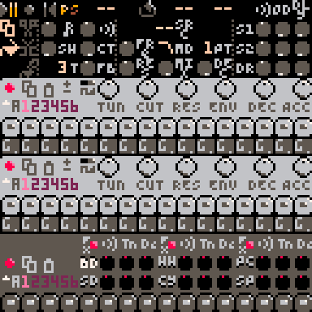
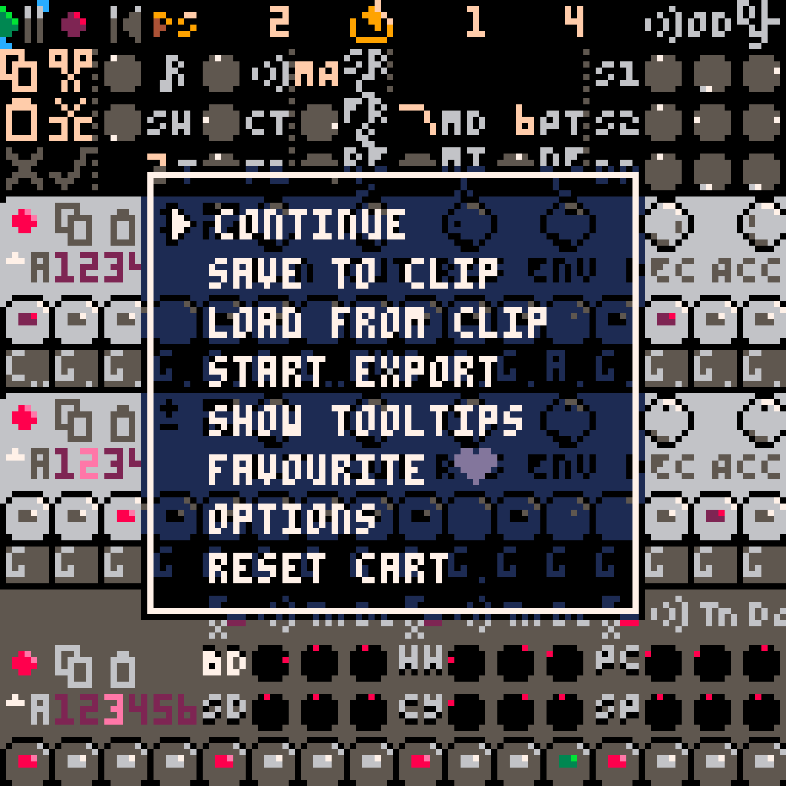

---
title: "RP-8 User Guide"
...

# Introduction

RP-8 is a Pico-8 demake of Propellerhead Software's [ReBirth
RB-338](https://en.wikipedia.org/wiki/ReBirth_RB-33://en.wikipedia.org/wiki/ReBirth_RB-338), one of the first
commercially successful software synthesizers. Like the original, it provides two synth voices, drums, pattern-based
sequencing, effects to enrich the sound, a pattern mode for immediate hands-on control, and a song mode for recording
music.

Unlike the original, the audio output is 8 bit 5.5kHz mono sound, and the user interface is rendered in glorious
128x128 16 color graphics.

{width=70%}

Thank you for trying RP-8, and please don't hesitate to let me know what might make RP-8 more pleasant or interesting to
use.^[You can contact me at [luchak@gmail.com](mailto:luchak@gmail.com) or via the [RP-8
thread](https://www.lexaloffle.com/bbs/?tid=47284) on the Lexaloffle BBS.]

## Using This Guide

This guide will introduce you to the instrument, its major features and underlying concepts, and how to go about
designing sounds and composing songs. If **you have never used ReBirth**, you should consider continuing to read
through the [Overview][] and [Usage][] sections, which introduce all the major concepts necessary for using RP-8, and
form a mini-tutorial where each part builds on the last. If **you have used ReBirth**, most of the functionality should
be familiar and you should probably dive right in -- however, there are some differences, so you might want to refer
back to this guide if you encounter anything unexpected.

The [Reference][] section describes the functioning and operation of each part of RP-8 in more detail, and should be
useful at any stage of your RP-8 journey.

# Overview

## Running RP-8

RP-8 is a [Pico-8](https://www.lexaloffle.com/pico-8.php) cartridge, or cart. You can run it on your own copy of
Pico-8 or on the web-based [Pico-8 Educational Edition](https://www.pico-8-edu.com) by loading the cart PNG file from
the [RP-8 thread](https://www.lexaloffle.com/bbs/?tid=47284) on the Lexaloffle BBS, or by typing `load #rp8` at the
Pico-8 prompt. (This latter approach will always get you the latest version.) You can also run RP-8 directly from the
Lexaloffle BBS thread. If you are running RP-8 in a browser, please keep your volume low to start, and see the [Web
Compatibility][] section for further details.

## Controls

RP-8 is controlled primarily using the mouse. Each control on the screen responds either to clicks or drags.
Typically, button and toggle controls respond to clicks, and dial or note controls respond to vertical dragging. Drag
controls also respond to the up and down arrows and to the mousewheel for fine adjustments.

You can access the menu by pressing **enter**, and toggle tooltips by pressing **h**. There are more [Keyboard
Controls][] too, but you don't need them to get started.

## Devices And Patterns

Sound in RP-8 is generated by its 3 devices: two identical monophonic synthesizers loosely inspired by the [Roland
TB-303]() and one drum machine that is even more loosely inspired by the [Roland TR-808]() These devices are explained
in more detail in their own sections.

In general, you should use the synthesizers for tonal elements in your songs, like melody or bass lines, and you should
use the drum machine for rhythmic elements. However, all the drums have a tuning adjustment knob, and many of the
sounds can have a strong tonal character, so stay open-minded!^[TR-808 bass drums with long decay times are often used
as bass sounds. The sample track of the drum machine can also easily be used as a third tonal voice.] Each device is
controlled by a pattern sequencer, which plays back sequences of notes or drum hits from a user-programmable
bank of patterns. Patterns are 16 step (1 bar) series of notes or drum hits, and are the building blocks of music in
RP-8.

RP-8 also has a header section at the top of the display, which houses controls that affect the whole song or pattern:
the song/pattern mode switch, song transport controls, effects controls, and the mixer.

## Modes

RP-8 has two modes: **pattern mode** and **song mode**. All the same devices and sound creation machinery are available
in both, however, they have different purposes. Pattern mode gives you immediate direct control of every parameter, so
it is ideal for learning, experimentation, and coming up with new ideas. Song mode records enables several features for
recording, editing, and replay of parameter changes, and so is best for when you want to start recording multi-bar
sequences and complex automation.

# Usage

This section provides a description of RP-8's basic usage mechanics, and is structured as a guided introduction to RP-8
for first-time users.

## Pattern Mode

### Making A Drum Pattern

Okay! You've got RP-8 loaded and you're ready to make some music. Let's start by creating a simple drum pattern. Notice
that at the bottom of the drum machine there are a row of *step buttons* that look like this:

Each button represents a 16th note time step. As you click the step buttons, they will rotate through a few different
states: gray, dull red, and bright red, representing whether a drum hit is played on that step, and the strength of the
hit. Click a few buttons, and then tap the spacebar (or click the play/pause button) to hear the results - you should
hopefully be hearing some bass drum hits and seeing green lights sweep from left to right across the step buttons.

While the bass drum is important, you'll probably want some other drums too. The drum machine offers six different
drums you can sequence, and you can switch between drums using the drum selector buttons, which look like this:

{width=6.25%}

If you click the snare drum selector, labeled **SD**, you'll see that the step buttons have all reset to gray. If you
click a few of these, you should now hear a snare playing along with your bass drum. To edit the bass drum again, you
can click **BD** to go back. Try sequencing some of the other drums as well!^[[The Drum Machine][] explains in more detail
what each drum is and how it works.] (Note that the **SP** drum is special and won't make any sound just yet - see the
[Loading Samples][] section for more information on how to enable it.)

### Making A Synth Pattern

Now that we've got a drum beat, let's try making a synth pattern to go along with it - this could serve as a melody or
a bass line. You'll notice that the synths have step buttons, like the drum machine, along with a row of note controls:

Like the drum machine, you can click the step buttons to cycle through different ways to play each note. The new,
yellow-colored states are for note slides - [The Synths][] explains the step types in more detail. However, by default,
each step will just play a G. You can use the note controls to change the note - drag up (or use the up arrow) to make
the note higher, or down to make the note lower. The note controls span several octaves, which are indicated by dots
below the note - more dots correspond to higher octaves. Try using these controls to program a simple melody or
bassline.

### Switching Patterns

While it's possible to make a song by repeating a single bar, it's also a bit of a challenge. Fortunately, RP-8
supports multiple patterns to allow for variations and longer phrases. You can switch between patterns using the
pattern and bank selector buttons:

{width=25%}

There are 8 banks (labeled A through H), with 6 patterns per bank (labeled 1 through 6). The bank selector is a drag
control, and the pattern buttons are click controls. Pattern changes take effect immediately while RP-8 is paused, but
if RP-8 is playing, pattern changes only take effect at the end of each bar. The current pattern displays in pink, and
the next pattern, if different from the current one, displays in red. If no patterns are lit up on a device (all
display in dull red) then the active pattern is in a different bank; to find the active one, flip through banks until
one lights up.

Each device has its own pattern storage, so each synth has separate pattern storage, along with the drum machine. Note
that each drum pattern contains all 6 drum *tracks*, and you cannot switch patterns independently for each drum track.

### Copying Patterns and Making Variations

It's often helpful to have multiple patterns based on the same idea: alternate rhythms, melodic variations, or drum
patterns that add or omit hits. To help with this, you can copy and paste patterns between slots on the same device, or
between the two synth devices.^[You cannot copy between the synths and the drum machine, or between different drum
tracks. All drum tracks in a drum pattern are copied together.] The pattern copy and paste buttons are located on the
devices just above the pattern buttons, and look like this:

{width=12.5%}

Click the copy button to copy the current pattern, and click the paste button to replace the current pattern with the
last copied pattern. If you have a pattern change pending for the next bar, these buttons operate on the currently
playing pattern, *not* on the pending pattern.

### Tweaking Sounds

RP-8 is designed for making music where sound design and timbral variation are important parts of the composition.
RP-8's screen is full of dials and switches that you can use to alter the character of your sound.

{width=70%}

You'll notice that some of these controls are located on the devices and some are located in the header section. The
controls located on each device control their respective devices only, the controls in the header section control the
effects units, how the device sounds are processed and mixed, and (in song mode) the song's position, arrangement, and
loop mode.

## Saving And Loading

RP-8 can save songs, load songs, export audio, and load samples for playback. Most of RP-8's save and load
functionality is provided through the Pico-8 pause menu, which you can access by pressing **enter**. Navigate this menu
with the arrow keys, and press **enter** again to make a selection.^[The **continue** option will let you exit the menu
without taking any action.]

{width=70%}

### Saving and Loading Songs

You can save your work to the clipboard by selecting **save to clip**. This will copy the current state of your song to
the clipboard. If you want to save to a file, open up any text editor and paste the contents of the clipboard there. If
you are using Pico-8 on the web, you may also be prompted to press ctrl-C to complete the copy operation.

You can load a song by copying it to the system clipboard, then pasting it into RP-8 with ctrl-V (or cmd-V if you're
using a Mac), then selecting **load from clip** from the pause menu. If RP-8 crashes or if nothing happens when you load, make sure that
you correctly copied the whole save data string - RP-8 may not behave properly if you load an invalid save.

### Checkpointing with the Clipboard

You can use the save/load operations to quickly checkpoint your progress. If you select **save to clip**, then the next
time you select **load from clip** you will load from that save. It's a good idea to save before any major experiments or
editing operations so you can quickly reload if something goes wrong.

You should also save to a file periodically, since your checkpoint will be lost if you close RP-8 or if it crashes.

### Exporting Audio

To export audio, select **start export** from the pause menu. RP-8 will begin recording its main output to a file. Play
your song, do a little improvisation, or whatever you want to record. When you're done, go back to the pause menu and
select **stop export**. Your recording will now be in a WAV file on your desktop.

The output file is not written until you select **stop export**, so remember to do that before you quit RP-8 -
otherwise you will lose your recording.

### Loading Samples

Each RP-8 song can store one audio sample, which you can play using the SP (**S**ample **P**layback) track on the drum
machine. First, choose your sample, and convert it to mono 5512kHz 8-bit unsigned raw PCM. You can do this with
[Audacity](https://www.audacityteam.org/), with [bikibird](https://bikibird.itch.io/)'s excellent
[Defy](https://bikibird.itch.io/defy) utility,^[If you use Defy, select the **Unsigned 8-bit PCM** output format, and
make sure the **Apply Antialiasing Filter** option is checked.] or with your audio editor of choice. Once you have
converted the sample, just drop the file onto RP-8 to load it into your song. If your sample is longer than about 5.9
seconds, RP-8 will truncate it, and if you have a sample already loaded, loading a new sample will replace it. You
should now be able to play back your sample as the 6th drum track!

## Song Mode

Now that you're familiar with making sound and saving your work, it's time to start making songs. Song mode allows you
to record parameter and pattern changes over time, and exposes a few extra tools to make this task easier. However, in
exchange for automation, you sacrifice a little bit of control:

* **in pattern mode**, you are in immediate direct control of every part of RP-8's sound. Every time you change a control,
    that change will "stick" until you change that control again.
* **in song mode**, the sequencer is in control of pattern selections and sound settings until you record new ones.
    You can also temporarily override some settings, but those overrides will not be permanent unless you explicitly
    commit them.

While pattern selection and sound settings are handled differently between the two modes, pattern *contents* - note and
step data - are shared. Changes to pattern content cannot be automated (if you want different notes, choose a different
pattern), and any changes to pattern content in one mode will be immediately reflected in the other mode as well.

This section will walk you through building up a 4-bar loop in song mode, and then how to expand this loop into a
full-fledged song.

### Starting A Song

While you can begin a song directly in song mode, it can be helpful to start in pattern mode to sketch out a few
starting patterns and dial in some of your sound. When you're ready, click the pattern/song mode selector toggle, or
use the **tab** key to switch into song mode. The mode you're in is reflected by whichever letter (P or S) is brighter.

{width=6.25%}

When you enter song mode, you'll notice a few new controls light up. We'll discuss most of these in more detail later -
the important thing to know is that right now RP-8 is set to play a 4-bar loop. If you hit play, you'll also notice
that any sound changes you've made in pattern mode haven't been copied over, so let's fix that now.

{width=6.25%}

Switch to pattern mode, and click the copy sequence button in the header section. Then switch back to song mode and
click the paste sequence button. Your 4-bar loop has been filled with the settings from pattern mode, which should form
a good start for your song.

### Transport and Loop Controls

Let's add a new section to the song. First, we'll need to understand how to use the transport controls at the top of
the screen:

{width=50%}

The position and loop controls are all bar numbers. Your song can contain up to 999 bars. Each of these controls
responds to drag inputs. When the loop enable toggle is on, playing past the end of the last bar of the loop will move
the song position back to the beginning of the loop. (If the song position is already beyond the end of the loop,
nothing will happen.)

The loop controls are extremely useful for a few reasons:

1. looping a section of your song allows you to focus on it for editing,
2. looping while live recording adjustments allows you to try multiple takes to get the right sound (more on this
   later), and
3. perhaps most importantly, all of the sequence edit buttons (like copy and paste above) act only on the current loop.
   This is true even if loop mode is disabled.^[If you want to edit the entire song, adjust your loop so it includes
   the whole song.]

Since we want to add a new section, let's set the loop so it covers the next 4 bars: that's a loop start of 5 and a
length of 4. Go to pattern mode, pick out some new pattern selections and sound settings, click **copy sequence**,
switch back to song mode, and click **paste sequence**. Your new section should be ready - these sections now fill bars
5 through 8. If you adjust the loop start to 1 and loop length to 8, you should be able to loop your whole song (such
as it is at this point).

### Adjusting Sound with Parameter Overrides

Play your song, and then start adjusting some of the sound controls. You'll notice that the record button at the top of
the screen turns from dull red to yellow. You'll also notice these two buttons light up:

{width=12.5%}

These changes indicate that you have made changes to the pattern selections or sound settings that have *not yet* been
committed to the song. Whenever you touch a new control, RP-8 adds that control to a list of overrides and will stop
automating that control. It will leave all these controls where you set them until:

1. You stop playback: the changes are discarded and overrides are cleared. (No action is taken on *starting* playback,
   only on stopping.)
2. You click the discard button: the changes are discarded, overrides are cleared, and parameter settings will reset to
   their recorded values at the start of the next bar. This is just like stopping playback, except you can leave the
   song playing.
3. You click the commit button: the changes are applied to the current loop and overrides are cleared. These changes
   *do not* include any automation, only the constant current values of the touched controls are used.
4. You start recording changes - see [Recording Changes][] for more details.

Parameter overrides are very useful for exploring adjustments to the sound of whole sections of your song at once.
The idea that RP-8 keeps track of which controls you've touched, and records adjustments for only those controls, is
also good to keep in mind in the other recording modes.

### Recording Changes

The adjust/commit workflow in the previous section is good for making sweeping changes across large parts of your song
at once. But for finer-grained changes, we'll want to use the record button. There are two different ways to use the
record button: step recording (making changes while paused), and real-time recording (making changes while playing).
Step recording is good for making changes to single bars at a time,^[This is especially useful for quickly sequencing
pattern changes.] while real-time recording is the only way to record changes in the middle of a bar.

Whether you are step recording or real-time recording, you will want to remember from the previous section the idea
that RP-8 tracks which controls you have touched in a recording session. RP-8 will not modify any control or record new
values for it until you touch that control. Once you do so, RP-8 stops automating the control and starts recording
changes to it. When you exit recording mode or stop playback, the set of touched controls is cleared.

You begin **step recording** by clicking the record button while RP-8 is paused. The record button will become bright
red, indicating that RP-8 is now recording. When you modify a control, you set its value for the current bar. When you
navigate to a new bar, every touched control's value is set for that bar. Note that this means that skimming through
lots of bars with record mode enabled is very dangerous! Consider using the up and down arrow keys to navigate through
the song with increased precision. When you are done, click the record button again to turn off recording.

To begin **real-time recording**, navigate to the bar at which you wish to start recording, click the record button,
and then begin playback. Adjust sounds with the mouse and keyboard as you normally would. If you stop playback and
replay the bars that you recorded, your adjustments will be played back just as you made them. (Although if you stop
partway through a bar, note that the whole bar's automation is replaced, not just up to the note at which you stopped.)

Touched controls are handled a little differently in real-time recording when looping is enabled: the set of touched
controls is cleared when the song loops. This makes it easier to layer changes, to retry a recording that didn't go as
planned, and to make sure that you don't overwrite any parameter settings you didn't mean to.

### Advanced Arrangement Editing

There are still a few song mode controls that we have not covered, and some additional subtleties to the controls we
discussed earlier.

{width=12.5%}

Copy sequence

: Copies the current pattern and control settings (if in pattern mode) or loop, including all automation
(if in song mode).

Cut sequence

: Acts identically to copy sequence, except it removes the current loop's bars from the song. Later bars are moved up
to fill the empty space.

Paste sequence

: Fills the current loop with the last copied sequence. If the copied sequence is shorter than the current loop, it is
repeated to fit. If the copied sequence is longer, it is truncated. Sequences copied from pattern mode are treated as
one-bar loops with no automation, and sequences pasted into pattern mode use only the first bar (and no automation).

Insert sequence

: Inserts new bars into the song to fill the current loop, so that the loop's old contents are now located just after
the loop. The new bars are then filled with the copied sequence, just as with paste.

## Closing Thoughts

You should now know enough to go make something! For more information on how the devices work and what specific
controls do, see the [Reference][] section.^[Once I write it....] For quick reminders in RP-8, remember that you can turn on tooltips.

If you get stuck or encounter what seems to be a bug, please reach out via the [BBS thread](https://www.lexaloffle.com/bbs/?tid=47284).

# Reference

## Audio Routing

## The Synths

## The Drum Machine

## Web Compatibility

## Keyboard Controls

key       | action
----------|-------
**enter** | access the pause menu
**h**     | toggle tooltips on/off
**space** | toggle play/pause
**tab**   | toggle pattern/song mode
**l**     | toggle loop on/off
**up**    | increase selected control one step
**down**  | decrease selected control one step
