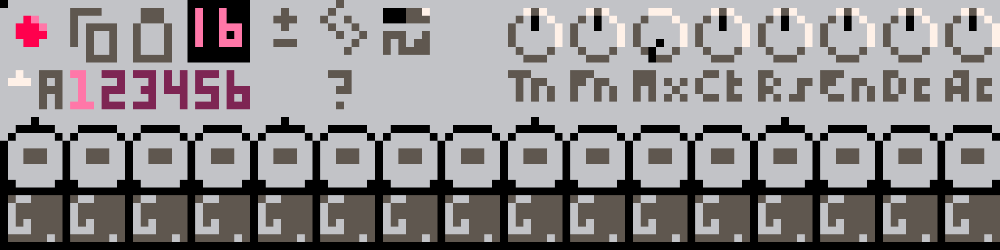
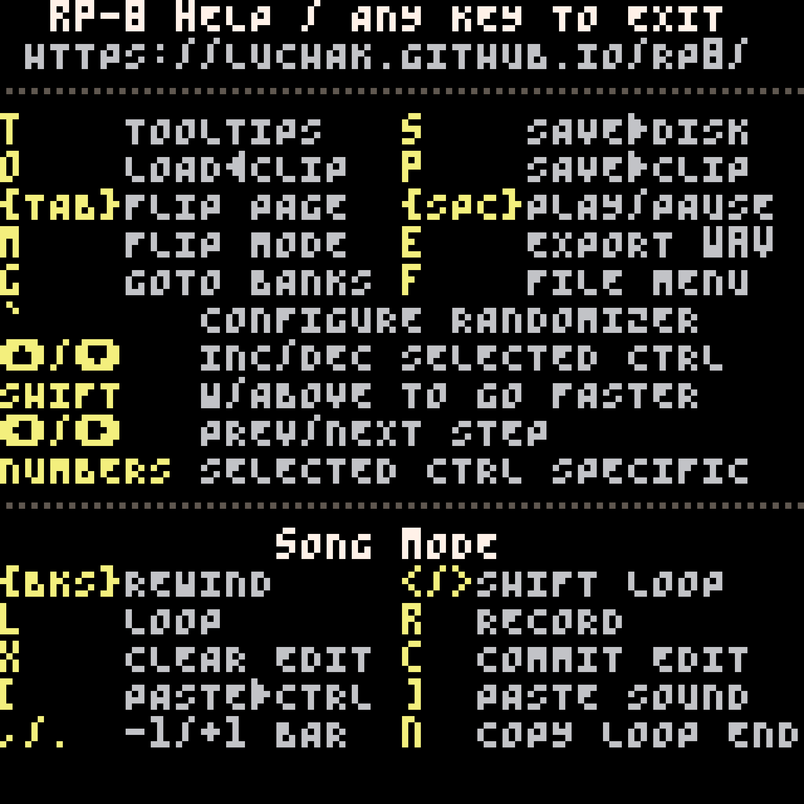

---
title: "RP-8 User Guide"
...

RP-8 is a Pico-8 demake of Propellerhead Software's [ReBirth RB-338](https://en.wikipedia.org/wiki/ReBirth_RB-338).
Like the original, it provides two synth voices, drums, pattern-based sequencing, effects, a pattern mode for immediate
hands-on control, and a song mode for recording music. Unlike the original, the audio output is crunchy 8 bit 5.5kHz
mono sound, and the user interface is rendered in 16 colors at a chunky 128x128 resolution.

This guide is written in two main parts: a tutorial-style [Getting Started] section that walks you through writing a
short song in RP-8, and a [Reference] section that explains the different main components of RP-8 in more detail. If
you ever get lost, remember that you can toggle tooltips on and off with `t`, and access keyboard shortcut reminders
with `h`.

Thanks for trying RP-8, and let me know if you have any thoughts! If you have thoughts, feedback, or would like help,
get in touch with me via [Itch](https://luchak.itch.io/rp8), the [RP-8 Discord](https://discord.gg/kGJJcpEkgv) or [your
favorite ActivityPub service](https://6t.vc/@luchak).

# Getting Started

This section will walk you through writing a simple song in RP-8: everything you need to know to make your own music.
There are two main things you'll learn: how to compose music in pattern mode, and how to arrange it in song mode. This
workflow closely resembles how I begin new tracks in RP-8, and it might be a good starting point for you too.

If you have never used ReBirth before, I highly recommend you follow this tutorial, as it introduces several important
ideas that are foundational to how RP-8 works. If you have used ReBirth, it's still probably a good idea to at least
skim the tutorial, since RP-8 does not function identically to ReBirth.

Let's begin!

## Pattern Mode: Composing and Experimenting

In RP-8, you compose music by writing patterns, which are sequences of up to 16 notes that you can play back in various
orders to make songs. RP-8 starts up in pattern mode, which gives you direct control over every aspect of what RP-8
does, and is perfect for basic composition tasks and experimenting with sound design.

### Make A Drum Pattern

Drums are never a bad place to start, so let's make a drum pattern. The drum machine is at the bottom of the screen and
looks like this:

At the bottom of the drum machine are the step buttons, which control what kind of sound (if any) plays on each step.
Click a few step buttons - you'll see that they light up - then click the play button at the top-left of the screen.
You should hear a bass drum playing the steps that you clicked.

{width=31.25%}

You may have noticed that the buttons can light up in different colors. For the drum machine, red and yellow are
different variations of the sound, and the intensity of the light indicates the volume of the hit (brighter means
louder). You can click a button multiple times to cycle through the options.

You have probably also noticed that the **BD** button on the drum machine is lit. There are 5 other similar buttons,
each representing a different drum. If you click one, you'll see that the steps get cleared: this is because you're now
editing a different drum in the same pattern.

**TASK:** Make a drum pattern using all 6 drums.

### Make A Synth Pattern

You should be all set for drums at this point, at least for one bar. How about a melody or a bassline? For this you'll
probably want to use one of the two synths, which look like this:

Like the drum machine, these have step buttons, but below the step buttons are note controls, which control what pitch
the synth plays at each step. You can drag up and down on the note controls to change which note plays on each step.

**TASK:** Try making a one-bar melody.

Like the drum machine, the step buttons light up in different colors, but the meaning of the red and yellow colors is
different. Red steps play notes as normal, but yellow steps are _slides_. Slide notes are longer and allow you to
smoothly slide between pitch on adjacent steps. Dimmer steps are played normally, brighter steps are accented.^[RP-8
tries to approximate the accent behavior of the TB-303, but it's a loose resemblance at best.]

### Name and Save Your Song

Now that you've done some work, it's probably good to save your song so you don't lose it.

**TASK**: Press `f` or click on the disk icon to bring up the file menu, then use the arrow keys to navigate down to
**Rename Song**, then press enter to open the song rename screen.. Enter a name for your song, and then (once you are
back at the main RP-8 screen) press `s` to save your song. The song has been saved to the folder that RP-8 is in. To
open this folder, you can go back to the file menu with `f` and select **Open Folder**.

You can also press `p` to quicksave your song to the clipboard. This is useful for quickly checkpointing your work.
RP-8 does not have undo, so use this feature often, especially before you make changes you're not sure about! You can
press `o` to quickload from the clipboard.

### Check Out the Integrated Help

By now you have probably noticed that RP-8 uses hotkeys for many features. You can press `h` at any point to view a
help screen with a list of hotkeys (and the URL to this user guide).

{width=50%}

You can also press `t` in the main view to toggle tooltips on and off.

**TASK:** Try turning on tooltips and checking out some of the control labels.

### Change the Sound

Ok, let's get back to making music. You've made a couple of loops, but you might find that the overall sound is a
little ... uninspiring. The good news is that you can make it better! RP-8 is packed with sound design controls.

{width=70%}

Both the synths and the drum machines have tons of knobs that affect the character of the sounds that they make, and
the section at the top of the screen lets you mix and apply effects to these sounds. Use can use tooltips for more
information on what each knob does.

**TASK:** Play around with the sound and dial in something you like!

### Make More Patterns

RP-8 supports multiple patterns to allow for variations and longer phrases. You can switch between patterns using the
pattern and bank selector buttons:

{width=25%}

There 8 banks (A-H) of 6 patterns each. You can drag on the bank selector to change banks, and click the number buttons
to pick a pattern in the bank. If RP-8 is paused, the pattern will change instantly, if it is playing, then the pattern
will change at the beginning of the next bar.

If you get lost and can't figure out which bank the current pattern is in, you can press `b` at any time to jump each
bank selector to the current pattern's bank.

{width=12.5%}

If you want to make a new variation of a pattern, you can use the pattern copy/paste buttons on the synths and the drum
machine to duplicate a pattern to a new slot for further editing. You can copy patterns between the two synths, but not
between the synths and the drum machine.

**TASK:** Make a few more patterns: maybe a bassline on one synth, a few bars worth of melody on the other synth, and one or two
drum loop variations on the drum machine.

If you're having fun - keep going! It'll be helpful to be fairly comfortable in pattern mode before moving on to
arrangement in song mode.

## Song Mode: Arranging and Automating

Sometimes one bar of music just isn't enough. That's when it's time for song mode, which allows you to arrange multiple
bars of music and record control movements. You can switch into song mode using the mode selector button, or by
pressing `m`.

{width=6.25%}

The most important change from song mode to pattern mode is that you are no longer in direct control of the sound
design or of which patterns are playing.^[Note that this does not include pattern contents (notes and steps). These are
shared with pattern mode, and changing them still works exactly like pattern mode.] Instead, the RP-8 sequencer
controls these, and any changes you make will be lost until you take special steps to record them. The sections below
explain three different recording methods you can use.

Don't worry if this doesn't make total sense yet. Let's start arranging our song, and everything should become clearer in the
process.

### Choose A Loop Length

In song mode, you'll find song position and loop controls at the top of the screen. Each control's value is measured in bars:

{width=50%}

These controls are essential in song mode. Not only do these controls let you choose which part of the song you are
play back, but the loop controls also act as a "selection" in the song: there are many operations in RP-8 that perform
an operation only on the bars contained in the current loop.

**TASK:** Since we are starting a new song, let's set our loop to start at bar 1^[It's okay to start at bar 1 even if we think we
might want to add an introduction, there are ways to move bars around later.] and be either 4 or 8 bars long.^[If you
forget which control is loop start and which is loop length, you can turn on tooltips with `t` for a reminder.] 

### Copy A Loop From Pattern Mode

You've probably noticed that, in song mode, all your sound edits from pattern mode have been lost. Instead of recreating them
manually, let's copy them over. You'll that there are copy/paste buttons not just on each device, but also near
the top of the screen:

{width=6.25%}

We can use these buttons to copy information about all the sound controls.

**TASK:** Switch back to pattern mode (by clicking the mode button or pressing `m`) and click the copy button, then
switch back to song mode, and click the paste button. Your loop should now be filled with the same control
configuration you had in pattern mode!

### Recording, 3 Ways

We're now going to use three different recording methods to build up some changes and structure in your loop.

### Change the Sound (Again)

This section demonstrates the first recording method: change-and-commit.

Try playing your new loop. (Make sure the loop enable control is turned on.) Now try changing some of the controls.
You'll notice that your changes look like they stay in effect ... until you pause playback. Then all your changes are
reset. You may also have noticed that the dark red record button next to the play button turns yellow when you start
making changes. What's going on here?

{width=25%}

When you start making changes, RP-8 notices that you've departed from the recorded sequence, and turns the record light
yellow to warn you. Any controls you have changed will stay where you left them, but any controls you have not touched
will stay under sequencer control. When you pause playback, RP-8 puts all controls back under sequencer control and
resets their values.

But what if you like your changes?

{width=12.5%}

Whenver you have uncommitted changes (i.e. the record button is yellow) the change discard/commit buttons will light
up. The discard button clears your changes, just like stopping playback.^[If RP-8 is playing, control values will reset
at the start of the next bar, if it is paused, they will reset immediately.] The commit button, on the other hand, will
keep your changes: each control you have modified will now keep its current position everywhere in your loop.^[But only
its current position - if you want more flexible recording, you'll have to read on.]

**TASK:** Try making some more changes to the sound in your loop. Then use the loop controls to select one or two bars
within your loop, and change the sound only in those bars. Set your loop back to its original length again and listen
to your new control automation!

### Automate the Sound

This section demonstrates the second recording method: realtime recording.

The technique above is easy, but only lets you make changes in full-bar chunks. If you want a nice filter sweep, you'll
have to use realtime recording instead. When you turn on record mode, by clicking the record button or pressing `r`,
the record button will light up bright red, and RP-8 will begin immediately recording all control changes you make to
the song.

If looping is enabled, RP-8 will forget about all changed controls each time playback loops. This allows you to record
automation for multiple controls in the same recording session, and means that you don't have to quickly hit stop to
avoid recording over the start of your loop.

When you pause playback, RP-8 will automatically exit record mode. You can also exit record mode by clicking the record
button.

**TASK:** Press `p` to quicksave your song in case something goes wrong or you record something you don't mean to.

**TASK:** Go to the beginning of your loop, enable recording, and hit play. Move the synth filter cutoff knobs. Each
time the song loops is a new take, so keep trying as long as you like!

### Sequence Your Patterns

This section demonstrates the third recording method: step recording.

We're now going to record some pattern changes in your loop. You could do this using either of the previous two
methods, but for pattern recording you often want to set patterns across many bars quickly. This is easy to do with
step recording. When record mode is active, any changed controls are written to any bar you visit, _even when paused_.
This means that you can enable recording, make some changes, and step forward or backward in the song to write those
changes to each new bar.

**TASK:** Press `p` to quicksave.

**TASK:** Sequence all the pattern changes you want in your loop! Go to the first bar of your loop and enter record
mode. Then select the patterns you want to play on that bar. Then use the the `.` key to move one bar forward and
select the patterns you want to play on that bar. If you want to keep the same patterns for multiple bars, you can just
skip through them, you do not need to click the pattern buttons again.^[You can also use the mouse to drag the song
position control to navigate, but you need to be careful. Every control modified in the current recording session will
be written to every bar you visit! You can easily overwrite many bars worth of sequencer data if you're not careful.]
If you make a mistake, you can backtrack with the `,` key to fix it, or if you make a big mistake, press `o` to
quickload your last checkpoint.

Congratulations! You now have a fully-sequenced loop. Let's finish this all off by copying your loop and making a
variation.

### Duplicate Your Loop

To make major changes to the arrangement, we need to use the song editing tools near the top of the screen. Two of
these, copy and paste, should be familiar from earlier, since we used them to initialize our loop from patern mode.

{width=12.5%}

All of these features use the current loop as their active selection.

**TASK:** Click the copy button to copy the current loop. Then click the insert button, which will insert the copied
bars into the current loop, moving the current loop and all later bars back to make space. You have just created a
duplicate of the loop! Keeping the loop length the same, advance the loop start to the end of the current loop, so we
can start editing the duplicated content.

**TASK:** Use what you have learned so far to write a B section to this tiny song!

### Create an ABA Structure

Let's do one more sequence edit, to add a copy of the original loop at the end of your B section, for a very brief ABA
structure.

**TASK:** Move the loop back to the beginning of the song, and copy your original loop. Then advance your loop point
just past your B section and click paste.

### Export To Audio

All right, we're ready to finish this off! Now we just need to use the .WAV export feature to render your song to
audio. There are two steps: first, prep your song for export by creating a few silent bars at the end. Then just enable
export and play your song from the start.

**TASK:** Add some silent bars at the end of your song. Move the loop past the end of the song and use change+commit
recording to disable all three instruments for this section (click the red circle on the left side of the instrument to
toggle whether it is enabled). Leave this loop enabled at the end of the song - you want to "trap" the playback
position here after export so you don't get unexpected sounds at the end of your recording.

**TASK:** Go back to the beginning of your song, and, while paused, press `e` to enable export. Then play your song
to the end, and press `e` when done. You'll see a new .WAV file on your desktop containing your exported audio.

## Closing Thoughts

Congratulations! You've just made a very short song with RP-8. Go make more!

For more information on how the devices work and what specific controls do, see the [Reference][] section.^[Once I
write it....] For quick reminders in RP-8, remember that you can turn on tooltips.

If you get stuck or encounter what seems to be a bug, please reach out via the [BBS thread](https://www.lexaloffle.com/bbs/?tid=47284).

# Reference

## Modes

RP-8 has two modes: **pattern mode** and **song mode**. All the same devices and sound creation machinery are available
in both, however, they have different purposes. Pattern mode gives you immediate direct control of every parameter, so
it is ideal for learning, experimentation, and coming up with new ideas. Song mode records enables several features for
recording, editing, and replay of parameter changes, and so is best for when you want to start recording multi-bar
sequences and complex automation.

## Pages

The RP-8 UI also has two sequencer pages, each accessible in both pattern and song modes. You can toggle between them with the `tab` key, or by clicking the `P1` / `P2` button near the top of the screen. Each page shows a different set of pitch controls for each pattern.

RP-8 starts on page 1. This page lets you control the pitch of oscillator 1 on both synths, and shows the drum pattern step buttons.

Page 2 contains secondary / relative pitch controls. These controls let you detune each drum (on the drum machine) or the second oscillator (on each synth) relative to the main pitch for each device. For the synth, this means you are detuning oscillator 2 relative to oscillator 1. For the drums, you are detuning each drum relative to whatever pitch is determined by the sound controls. (The base pitch of each drum with all knobs at their default positions is usually G in some octave.)

## Advanced Arrangement Editing

{width=12.5%}

Copy sequence

: Copies the current pattern and control settings (if in pattern mode) or loop, including all automation
(if in song mode).

Cut sequence

: Acts identically to copy sequence, except it removes the current loop's bars from the song. Later bars are moved up
to fill the empty space.

Paste sequence

: Fills the current loop with the last copied sequence. If the copied sequence is shorter than the current loop, it is
repeated to fit. If the copied sequence is longer, it is truncated. Sequences copied from pattern mode are treated as
one-bar loops with no automation, and sequences pasted into pattern mode use only the first bar (and no automation).

Insert sequence

: Inserts new bars into the song to fill the current loop, so that the loop's old contents are now located just after
the loop. The new bars are then filled with the copied sequence, just as with paste.

## Devices

Sound in RP-8 is generated by its 3 devices: two identical 2-ocillator synthesizers loosely inspired by the [Roland
TB-303](https://en.wikipedia.org/wiki/Roland_TB-303) and one drum machine that is even more loosely inspired by the
[Roland TR-808](https://en.wikipedia.org/wiki/Roland_TR-808). These devices are explained in more detail in their own
sections.

In general, you should use the synthesizers for tonal elements in your songs, like melody or bass lines, and you should
use the drum machine for rhythmic elements. However, all the drums have a tuning adjustment knob, and many of the
sounds can have a strong tonal character, so stay open-minded!^[TR-808 bass drums with long decay times are often used
as bass sounds. The FM and percussion tracks of the drum machine can also easily be used as additional tonal voices.]
Each device is controlled by a pattern sequencer, which plays back sequences of notes or drum hits from a
user-programmable bank of patterns. Patterns are 16 step (1 bar) series of notes or drum hits, and are the building
blocks of music in RP-8.

RP-8 also has a mixer and transport section at the top of the display, which houses controls that affect the whole song
or pattern: the song/pattern mode switch, song transport controls, effects controls, and the mixer.

### Audio Routing

Each of the two synthesizers and the drum machine is routed into its own overdrive unit. The overdrive outputs are sent
to the mixer, which separately mixes these voices into a dry signal and a delay send signal. The delay send signal is
sent to the delay effect, whose output is then mixed with the dry signal and sent to the compressor. Finally, soft
saturation is applied to the signal before it is output to the speaker.

This routing can be varied in two ways: 

### Synths

### Drum Machine

The drum machine offers six different drum tracks. Each track offers two different drum sounds, each at two different
volume levels. Sound selection is indicated by step color: one sound is red, one sound is yellow. Sound intensity is
indicated by button light intensity: brighter steps are louder, or accented.

Each sound has two different controls: **Tn** (tune) and **Dc** (decay). These controls work slightly differently for
each sound. Each track also has its own step pattern with its own length, and you can use step patterns of different
lengths to create polyrhythms. The drums can be transposed by semitone in the second sequencer page.

By default, all of the six tracks are processed through the overdrive and delay effects, as well as the pattern filter
if its source is set to DR. You can cycle through the **FX** button settings for each pair of tracks to turn on or off
the effects for each track separately. When effects are bypassed for a track, that track is not processed by overdrive,
not processed by the pattern filter (if the pattern filter is set to **DR** mode), and not sent to the delay send bus.

**Bass Drum (BD)**

The bass drum sounds use simple waveforms that start out at high volume and pitch, then rapidly decay to low volume and
low pitch. The **Tn** knob controls the starting pitch, and the **Dc** knob controls now rapidly the volume and pitch
decay. When not transposed, the ending pitch is approximately 49 Hz (G1). Transposing the drums affects both the
starting and ending pitch.

*Red sound:* This is an approximately 808-style bass drum using a sine wave and simple exponential envelopes.

*Yellow sound:* This is closer to a 909-style bass drum. It uses a triangle wave, and the exponential envelopes are
limited at the start of the drum hit, in order to approximate a compressed sound.

**Snare Drum (SD)**

The snare drum mixes a sine wave exponentially decaying in pitch and volume, like the bass drum, with exponentially
decaying noise. This whole signal is then sent through a gentle highpass filter. The **Tn** knob controls the pitch of
the sine wave, and the **Dc** knob controls the decay time of the envelopes.

*Red sound:* This is a short, snappy, noisy snare drum. The tonal sine wave component is fairly quiet, and the decay
times are relatively short.

*Yellow sound:* This is a slightly heavier, darker snare. The tonal component is louder, the decay is longer, and the
highpass filter is set slightly lower to retain more midrange frequencies.

**Hihat (HH)**

The hihat is a short burst of noise, mixed with several high-pitch detuned square waves at inharmonic frequency ratios.
All of these are highpass filtered, and decay exponentially in volume. The **Tn** knob controls the pitch of the square
waves, and the **Dc** knob controls the decay time. Both closed and open hihats are on this track, so playing a closed
hihat will cut off an open hihat sound (and vice versa), allowing you to achieve a classic hihat choke effect.

*Red sound:* This is a closed hihat with shorter decay.

*Yellow sound* This is an open hihat, with a longer decay.

**Cymbal (CY)**

The cymbal sound is generated identically to the hihat (**HH**) sound, but this track is tuned for longer decay times and
slightly higher pitches. The knobs work identically to the hihat knobs. Like the hihats, the cymbals will mute each
other - this is not a typical effect, but try it out and see what happens!

*Red sound:* This is a cymbal with a shorter decay, like a ride.

*Yellow sound:* This is a cymbal with a longer decay, like a crash.

**Percussion (PC)**

This sound is synthesized identically to the bass drum (**BD**), but at higher pitches and with shorter decay times. By
changing the tuning you can create sounds similar to toms, congas, rimshots, and more. Play around and see what you
get!

*Red sound:* Same as **BD**.

*Yellow sound:* Same as **BD**.

**FM (FM)**

This is an FM sound made from two sine wave operators. You can use this to make metallic or other tonal percussive
sounds. The pitches of each operator remain constant during each drum hit, but both the volume and the amount of
modulation decay exponentially. The **Tn** knob controls the operator frequency ratio, and the **Dc** knob controls the
envelope decay times.

The frequency ratios range from 1/4 (at the bottom end of the knob range) to 4 (at the top end of
the range). Each increment of 32 in the knob value doubles the frequency ratio, so the default position of 64
corresponds to a frequency ratio of 1, and **Tn** knob values that are multiples of 8, 16, or 32 will produce less
dissonant sounds. Try the **shift+up arrow** and **shift+down arrow** hotkeys to step through **Tn** knob settings in
steps of 16.

*Red sound:* Light modulation intensity, producing cleaner, simpler sounds.

*Yellow sound:* Heavy modulation intensity producing harsher, more complex sounds.

### Effects

RP-8 contains several effects to help shape the sound of the synths and drum machine. Please refer to the audio routing
diagram from the [Audio Routing] section for more information.

**Overdrive**

There are three overdrive units, one for each of the two synths and for the drum machine. Each one independently
distorts the audio for its device. The **OD** knobs in the mixer section control the intensity of the overdrive effect
for each device, and the **ODS** knob (**O**ver**D**rive **S**hape) controls the tone and color of all three overdrive
units. Higher values produce thinner, scratchier overdriven tones with more odd harmonics.

**Delay**

The delay unit is a tempo-synced digital delay on a shared send bus. The delay times can be set in 16th notes (shown as
number of 16th notes, 1-16), 16th note triplets (shown as 1T-16T), or dotted 16th notes (a number of 16th notes plus a
32nd note, shown as 0D-15D). The **FB** control controls the amount of delay feedback. There is a small amount of
highpass filtering in the delay feedback loop so the delayed sound does not become too muddy.

**Pattern Filter**

The pattern filter is a 2 pole state variable filter with lowpass and bandpass modes. It differs from the other effects
in that it can take its signal from several possible different sources. These are controlled by the **SRC** control.
The possible sources are **- -**, or disabled, **S1**, **S2**, and **DR**, for the synths and the drum machine, and
**MA**, for the main audio output after the mixer.

The **MD** control selects the filter mode: lowpass (shelf shaped) or bandpass (peaked). **FRQ** controls the cutoff
frequency, **RES** the resonance, **PT** selects the filter pattern, and **AMT** and **DEC** affect how that filter
pattern is applied.

The filter patterns control a filter modulation envelope. Each pattern is a different sequence of triggers of different
intensities and timings. Different patterns have different lengths: some are 16 steps, and so line up neatly with the
bar length, but other patterns are odd lengths that can help you create complex rhythmic effects. The **AMT** knob
controls how strong the pattern triggers are: if the knob is all the way up, the strongest triggers will always bring
the filter up to its maximum frequency (at least momentarily). If the knob is all the way down, the pattern will have
no effect. The **DEC** knob controls the filter envelope decay time.

**Compressor**

The compressor is applied last of all RP-8's effects. There is only one control, the **CT** knob, which controls the
compressor threshold. By default, the knob is all the way up, which means that the compressor will rarely have any
effect. Reducing the compressor threshold should help make your song sound more even in volume, and should help your
drum sounds and synth sounds fit together better. There's just one knob - try adjusting it and see if you like the
results!

The technical details: this compressor uses linear scaling (not logarithmic) with a hard knee, a fixed ratio of 4, and
fixed attack and release times of approximately 2.5ms and 60ms, respectively.

## Keyboard Controls

You can press `h` at any time to get a list of these shortcuts in RP-8. If keyboard shortcuts appear to not be
working, check to see if you have caps lock enabled: these shortcuts only work with caps lock off.

**All Modes**

key           | action
--------------|-------
`t`           | toggle tooltips on/off
`s`           | save song to RP-8 folder and to clipboard
`o`           | load song from clipboard
`p`           | save song to clipboard only
`tab`         | switch sequencer page
`space`       | toggle play/pause
`m`           | toggle song/pattern mode
`e`           | stop/start exporting audio
`b`           | change each bank control to the current pattern's bank
`f`           | open the file menu
`up`          | increase selected control one step
`down`        | decrease selected control one step
`shift+up`    | increase selected control multiple steps
`shift+down`  | decrease selected control multiple steps
`left`        | go to previous pattern step
`right`       | go to next pattern step
`0-4`         | on pattern buttons: set step type

**Song Mode Only**

key         | action
------------|-------
`backspace` | rewind song
`l`         | toggle loop on/off
`r`         | toggle recording on/off
`x`         | clear control overrides
`c`         | commit control overrides to loop
`[`         | paste to selected control only
`]`         | paste sound only (controls but not pattern selections)
`,`         | previous bar
`.`         | next bar
