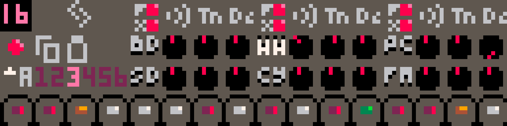

---
title: "RP-8 User Guide"
...

# Introduction

RP-8 is a Pico-8 demake of Propellerhead Software's [ReBirth
RB-338](https://en.wikipedia.org/wiki/ReBirth_RB-33://en.wikipedia.org/wiki/ReBirth_RB-338), one of the first
commercially successful software synthesizers. Like the original, it provides two synth voices, drums, pattern-based
sequencing, effects to enrich the sound, a pattern mode for immediate hands-on control, and a song mode for recording
music.

Unlike the original, the audio output is 8 bit 5.5kHz mono sound, and the user interface is rendered in glorious
128x128 16 color graphics.

{width=60%}

Thank you for trying RP-8, and please don't hesitate to let me know what might make RP-8 more pleasant or interesting to
use.^[You can contact me at [luchak@gmail.com](mailto:luchak@gmail.com) or via the [RP-8
thread](https://www.lexaloffle.com/bbs/?tid=47284) on the Lexaloffle BBS.]

## Using This Guide

This guide will introduce you to the instrument, its major features and underlying concepts, and how to go about
designing sounds and composing songs. If **you have never used ReBirth**, you should consider continuing to read
through this section and the Getting Started mini-tutorials. If **you have used ReBirth**, most of the functionality
should be familiar and you should probably dive right in -- however, there are some differences, so you might want to
refer back to this guide if you encounter anything unexpected.

## Running RP-8

RP-8 is a [Pico-8](https://www.lexaloffle.com/pico-8.php) cartridge, or cart. You can run it on your own copy of
Pico-8 or on the web-based [Pico-8 Educational Edition](https://www.pico-8-edu.com) by loading the cart PNG file from
the [RP-8 thread](https://www.lexaloffle.com/bbs/?tid=47284) on the Lexaloffle BBS, or by typing `load #rp8` at the
Pico-8 prompt. (This latter approach will always get you the latest version.) You can also run RP-8 directly from the
Lexaloffle BBS thread. If you are running RP-8 in a browser, please keep your volume low to start, and see the [Web
Compatibility][] section for further details.

## Controls

RP-8 is controlled primarily using the mouse. Each control on the screen responds either to clicks or drags.
Typically, button and toggle controls respond to clicks, and dial or note controls respond to vertical dragging. Drag
controls also respond to the up and down arrows and to the mousewheel for fine adjustments. You can access the menu by
pressing **enter**, and toggle tooltips by pressing **h**. There are other [Keyboard Controls][] too, but they're just
present for convenience; you don't need them to get started.

## Devices

Sound in RP-8 is generated by its 3 devices: two identical monophonic synthesizers loosely inspired by the [Roland
TB-303]() and one drum machine that is even more loosely inspired by the [Roland TR-808]() These devices are explained
in more detail in their own sections.

In general, you should use the synthesizers for tonal elements in your songs, like melody or bass lines, and you should
use the drum machine for rhythmic elements. However, all the drums have a tuning adjustment knob, and many of the
sounds can have a strong tonal character, so stay open-minded!^[TR-808 bass drums with long decay times are often used
as bass sounds. The sample track of the drum machine can also easily be used as a third tonal voice.] Each device is
controlled by a pattern sequencer, which plays back 16-step sequences of notes or drum hits from a user-programmable
bank of patterns. These patterns are the building blocks of music in RP-8. RP-8 assumes each pattern is 1 bar.^[Maybe
this will change someday, but for now you're stuck with 4/4.] 

## Modes

RP-8 has two modes: **pattern mode** and **song mode**. They look very similar, but have different purposes. Pattern
mode is ideal for learning the controls, experimentation, and coming up with new ideas, since you are in immediate,
direct control of every parameter on the display. Song mode is best for when you want to start recording multi-bar
sequences and complex automation.

# Getting Started

## Your First Pattern

Okay! You've got RP-8 loaded and you want to make some sounds. 

# Usage

## Making Patterns

## Song Mode

## Recording Automation

## Saving and Loading

# Reference

## Audio Routing

## Synth Controls

## Drum Controls

## Web Compatibility

## Keyboard Controls

key       | action
----------|-------
**enter** | access the menu
**h**     | toggle tooltips on/off
**space** | toggle play/pause
**tab**   | toggle pattern/song mode
**l**     | toggle loop on/off
**up**    | increase selected control one step
**down**  | decrease selected control one step
